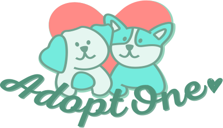

  <h1>ADOPTONE</h1>

  

## O QUE É:
AdoptOne é um projeto para a disciplina de Programação para WEB I, do curso de sistemas de informação da  UFPI. O objetivo dá disciplina é o desenvolvimento do front-end de um site usando as tecnologias HTML5, CSS3 e Javascript.

 

  <H2>ACESSE:</H2>
  

 

## CONTEXTO:
O aumento no número de casos de abandono de animais de estimação é preocupante. Vários animais são encontrados todos os dias em um estado deplorável e, por mais que existam várias ONGs preocupadas em ajudá-los, o número é muito inferior à demanda, rincipalmente nas grandes cidades. Um dos grandes problemas que a maioria das ONGs que lidam com animais de estimação bandonados e com a adoção dos mesmos é a dependência financeira de entidades estatais. Nesse sentido, a maioria das ONGs sofrem com a falta de recursos e, geralmente, não contam com uma estrutura adequada. O “apadrinhamento” surgiu como uma ferramenta que possibilita o crescimento de ajuda destinadas a essas ONGs, uma maneira prática de auxiliar nos cuidados com os animais e indicada a pessoas que querem adotar mais infelizmente não podem, devido a não possuírem tempo para dedicar ao cuidado deles, ao assumir um cão ou gato através dessa prática ele se torna o seu “afilhado” e com uma quantia mensal, determinada ao seu critério, a pessoa pode colaborar a mantê-lo. Um dos setores menos afetados pela crise da Covid-19 foi o dos pets: a área e cuidados, acessórios e alimentos, classificada como serviço essencial desde o princípio, cresceu 13,5% em 2020, segundo o Instituto Brasil Pet. Além disso, o nicho dos compradores dos serviços e produtos não se limita à idade ou faixa salarial e, em grande parte, é fidelizado.

  

## Ideia:
O AdoptOne foi idealizado como um site que visa auxiliar e inovar na maneira de ajudar animais abandonados e em situação de rua. Através de uma plataforma clara, essa aplicação contará com a oferta de instruções sobre os primeiros socorros em caso de acidentes com esses animais, para que as pessoas consigam auxiliá-los de maneira correta até que ele seja resgatado, possuirá também uma página de “apadrinhamento”, permitindo que os usuários se tornem tutores e possam auxiliar a manter os cuidados ecessários para o animal escolhido, essa página contará ainda com a possibilidade desses tutores marcarem visitas para acompanhar de perto os cuidados que o seu apadrinhamento estará roporcionando, além de ter a realização de cadastro de usuários, será possível também a realização de adoções de maneira responsável, com certificados de adoções e termos de compromisso.

  

